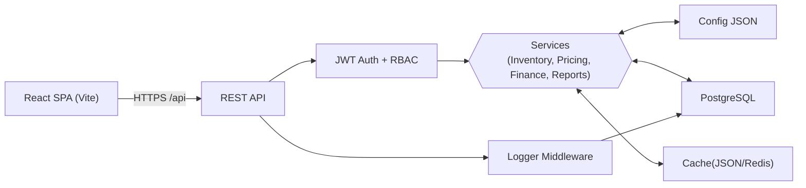

# Tradeflow Core

A lightweight tradeflow system designed for small businesses, built with React.js based frontend and Node.js + PostgreSQL based backend.

## Key Features

- **Inventory Management**: Track inventory levels, inbound and outbound operations
- **Product Management**: Manage product information and pricing strategies
- **Financial Tracking**: Monitor accounts payable and accounts receivable
- **Sales Analysis**: Generate reports and analyze sales data
- **Multi-language Support**: Supports English, Korean, and Chinese
- **Data Export**: Supports data export in Excel format
- **JWT Authentication**: Stateless authentication system
- **Role-Based Access Control**: Can assign **Editor** and **Viewer** to each user

## Tech Stack

- **Frontend**: React 19, Vite, Ant Design, TypeScript
- **Backend**: Node.js, Express, PostgreSQL, TypeScript
- **Authentication**: JWT stateless authentication
- **Styling**: CSS3, Ant Design component library
- **Logging**: Winston logging system
- **Precise Calculations**: Decimal.js for precise numerical calculations

## Backend Architecture Overview



## Demo

This is the detailed page for my demo link:
[My Demo](https://lihaozhe013.github.io/lihaozhe-website/posts/tradeflow-system/)


## Database Schema (Backend)

> The project uses Prisma as ORM, to support SQLite, which doesn’t support **Date**, we use TEXT for all dates instead…

### PARTNERS

| Column Name | Data Type | Key    | Nullable | Default |
| ----------- | --------- | ------ | -------- | ------- |
| code        | TEXT      | Unique | No       | NULL    |
| short_name  | TEXT      | PK     | No       | NULL    |
| full_name   | TEXT      |        | No       | NULL    |
| type        | INTEGER   |        | No       | NULL    |

### PRODUCTS

| Column Name   | Data Type | Key    | Nullable | Default |
| ------------- | --------- | ------ | -------- | ------- |
| code          | TEXT      | Unique | No       | NULL    |
| category      | TEXT      |        | No       | NULL    |
| product_model | TEXT      |        | No       | NULL    |
| remark        | TEXT      |        | No       | NULL    |

### PRODUCT PRICE

| Column Name        | Data Type | Key                                   | Nullable | Default           |
| ------------------ | --------- | ------------------------------------- | -------- | ----------------- |
| id                 | INTEGER   | UNIQUE, PK                            | No       | AI                |
| partner_short_name | TEXT      | FK $\subseteq$ PARTNERS.short_name    | No       | NULL              |
| product_model      | TEXT      | FK $\subseteq$ PRODUCTS.product_model | No       | NULL              |
| effective_date     | TEXT      |                                       | No       | CURRENT_TIMESTAMP |
| unit_price         | REAL      |                                       | No       | NULL              |

### INBOUND RECORDS

| Column Name    | Data Type | Key                          | Nullable | Default           |
| -------------- | --------- | ---------------------------- | -------- | ----------------- |
| id             | INTEGER   | UNIQUE, PK                   | No       | AI                |
| supplier_code  | TEXT      | FK $\subseteq$ PARTNERS.code | No       | NULL              |
| product_code   | TEXT      | FK $\subseteq$ PRODUCTS.code | No       | NULL              |
| quantity       | INTEGER   |                              | No       | 0                 |
| unit_price     | REAL      |                              | No       | 0                 |
| total_price    | REAL      |                              | No       | 0                 |
| inbound_date   | TEXT      |                              | No       | CURRENT_TIMESTAMP |
| invoice_date   | TEXT      |                              | Yes      | NULL              |
| invoice_number | TEXT      |                              | Yes      | NULL              |
| receipt_number | TEXT      |                              | Yes      | NULL              |
| order_number   | TEXT      |                              | Yes      | NULL              |
| remark         | TEXT      |                              | Yes      | NULL              |

### OUTBOUND RECORDS

| Column Name    | Data Type | Key                          | Nullable | Default           |
| -------------- | --------- | ---------------------------- | -------- | ----------------- |
| id             | INTEGER   | UNIQUE, PK                   | No       | AI                |
| customer_code  | TEXT      | FK $\subseteq$ PARTNERS.code | No       | NULL              |
| product_code   | TEXT      | FK $\subseteq$ PRODUCTS.code | No       | NULL              |
| quantity       | INTEGER   |                              | No       | 0                 |
| unit_price     | REAL      |                              | No       | 0                 |
| total_price    | REAL      |                              | No       | 0                 |
| outbound_date  | TEXT      |                              | No       | CURRENT_TIMESTAMP |
| invoice_date   | TEXT      |                              | Yes      | NULL              |
| invoice_number | TEXT      |                              | Yes      | NULL              |
| receipt_number | TEXT      |                              | Yes      | NULL              |
| order_number   | TEXT      |                              | Yes      | NULL              |
| remark         | TEXT      |                              | Yes      | NULL              |

### INVENTORY

| Column Name   | Data Type | Key                                       | Nullable | Default |
| ------------- | --------- | ----------------------------------------- | -------- | ------- |
| product_model | TEXT      | PK, FK $\subseteq$ PRODUCTS.product_model | No       | NULL    |
| quantity      | INTEGER   |                                           | No       | 0       |

### INVENTORY LEDGER

| Column Name   | Data Type | Key                                   | Nullable | Default           |
| ------------- | --------- | ------------------------------------- | -------- | ----------------- |
| id            | INTEGER   | UNIQUE, PK                            | No       | AI                |
| product_model | TEXT      | FK $\subseteq$ PRODUCTS.product_model | No       | NULL              |
| change_qty    | INTEGER   |                                       | No       | NULL              |
| change_type   | TEXT      |                                       | No       | NULL              |
| reference_id  | INTEGER   |                                       | Yes      | NULL              |
| date          | TEXT      |                                       | No       | NULL              |
| created_at    | TIMESTAMP |                                       | No       | CURRENT_TIMESTAMP |

### RECEIVABLE PAYMENTS

| Column Name   | Data Type | Key                          | Nullable | Default           |
| ------------- | --------- | ---------------------------- | -------- | ----------------- |
| id            | INTEGER   | UNIQUE, PK                   | No       | AI                |
| customer_code | TEXT      | FK $\subseteq$ PARTNERS.code | No       | NULL              |
| amount        | REAL      |                              | No       | 0                 |
| pay_date      | TEXT      |                              | No       | CURRENT_TIMESTAMP |
| pay_method    | TEXT      |                              | Yes      | NULL              |
| remark        | TEXT      |                              | Yes      | NULL              |

### PAYABLE PAYMENTS

| Column Name   | Data Type | Key                          | Nullable | Default           |
| ------------- | --------- | ---------------------------- | -------- | ----------------- |
| id            | INTEGER   | UNIQUE, PK                   | No       | AI                |
| supplier_code | TEXT      | FK $\subseteq$ PARTNERS.code | No       | NULL              |
| amount        | REAL      |                              | No       | 0                 |
| pay_date      | TEXT      |                              | No       | CURRENT_TIMESTAMP |
| pay_method    | TEXT      |                              | Yes      | NULL              |
| remark        | TEXT      |                              | Yes      | NULL              |

### SYSTEM LOGS

| Column Name | Data Type | Key        | Nullable | Default           |
| ----------- | --------- | ---------- | -------- | ----------------- |
| id          | INTEGER   | UNIQUE, PK | No       | AI                |
| username    | TEXT      |            | Yes      | NULL              |
| action      | TEXT      |            | No       | NULL              |
| resource    | TEXT      |            | No       | NULL              |
| user_agent  | TEXT      |            | Yes      | NULL              |
| params      | TEXT      |            | Yes      | NULL              |
| created_at  | TIMESTAMP |            | No       | CURRENT_TIMESTAMP |

## API Overview

- **Base URL**: `/api`
- **Auth**: `POST /api/login` returns a JWT; include `Authorization: Bearer <token>` in subsequent requests.

Key endpoints (high level):

| Area                 | Method & Path                                                        | Purpose                                                                        |
| -------------------- | -------------------------------------------------------------------- | ------------------------------------------------------------------------------ |
| Auth                 | `POST /api/login`                                                    | Exchange credentials for JWT                                                   |
| Overview             | `GET /api/overview/stats`                                            | Fetch dashboard metrics                                                        |
| Overview             | `POST /api/overview/stats`                                           | Trigger metrics recomputation                                                  |
| Products             | `/api/products` (GET, POST, PUT, DELETE)                             | CRUD endpoints for product catalog                                             |
| Partners             | `/api/partners` (GET, POST, PUT, DELETE)                             | CRUD endpoints for customers/suppliers                                         |
| Pricing              | `/api/product-prices` (GET, POST, PUT, DELETE)                       | CRUD partner-specific product prices (also see `/current` and `/auto` helpers) |
| Inventory Inbound    | `/api/inbound` (GET, POST, PUT, DELETE); `POST /api/inbound/batch`   | Receive goods and perform batch updates                                        |
| Inventory Outbound   | `/api/outbound` (GET, POST, PUT, DELETE); `POST /api/outbound/batch` | Ship goods and perform batch updates                                           |
| Stock                | `GET /api/stock`                                                     | Real-time stock summary by product                                             |
| Finance - Receivable | `/api/receivable/payments` (GET, POST, PUT, DELETE)                  | Track customer payments                                                        |
| Finance - Payable    | `/api/payable/payments` (GET, POST, PUT, DELETE)                     | Track supplier payments                                                        |
| Export               | `POST /api/export/:type`                                             | Export configured datasets (e.g., inventory, base-info, invoice)               |

## Quick Start

### Prerequisites

- Node.js 24+ (Always based on latest LTS version)
- pnpm
- Python/uv (for build script)
- PostgreSQL
- Docker (Optional)

### Docker-Based Deployment

1. **Copy necessary files**

- Download and put `compose.yaml` from the root directory and the `config-example/config/` directory, and put them in the root directory in your production environment

2. **Setup PostgreSQL**

- Use `scripts/init_postgres.sql` to initialize the database, your database name, password and username should match the information inside the `config.yaml` file.

3. **Start Server**

```bash
docker compose pull
docker compose up -d
```

### Manual Build

1.  **Clone the project**:

```bash
git clone [https://github.com/lihaozhe013/tradeflow-core.git](https://github.com/lihaozhe013/tradeflow-core.git)
cd tradeflow-core
```

2.  **Install dependencies**:

```bash
pnpm install:all
```

3.  **Set up configuration**:

```bash
# Copy the example configuration files
cp -r config-example/* .
```

4.  **Customize the build-config files**

- `about.json`: Customize your company info
- `exportConfig`: Customize your export format. You can change the order of columns, the column name, or add a customized column in this file
- `frontendConfig.json`: Customize frontend options

4.  **Build**:

> Note: I use `uv run` instead of `python` because the `python` command is incompatible across different systems. It is strongly recommended to use `uv`. If you prefer not to use `uv`, you can modify the `pnpm build` command yourself to `python build.py` or `python3 build.py`.

```bash
pnpm build
```

or

```bash
python3 build.py
```

### Development

1.  **Start the development servers**:

```bash
# Start the dev server()
pnpm dev
```
