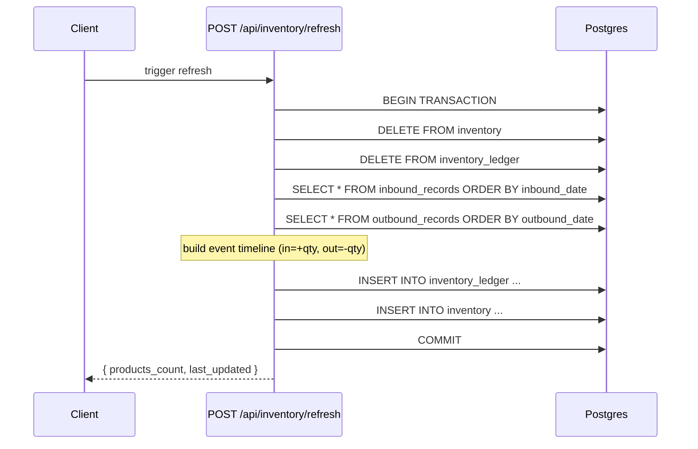
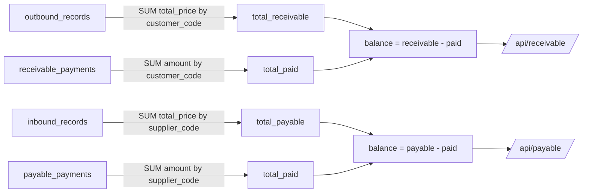
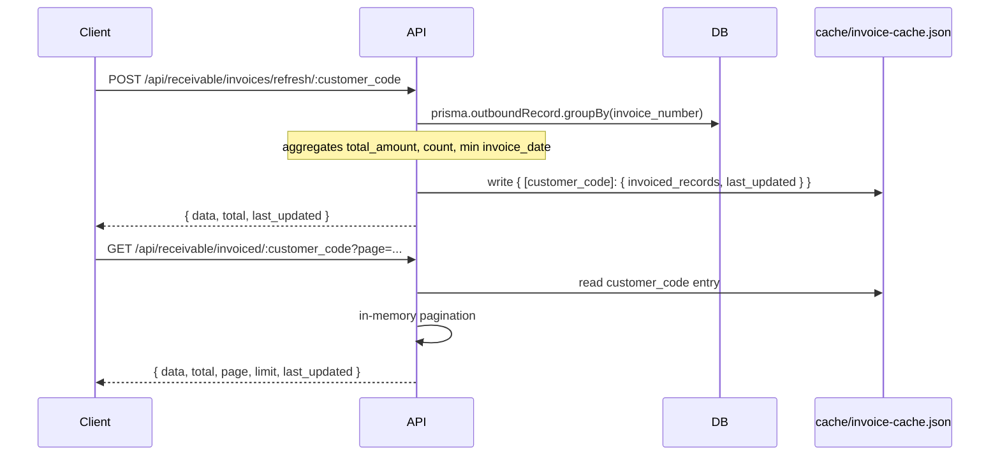
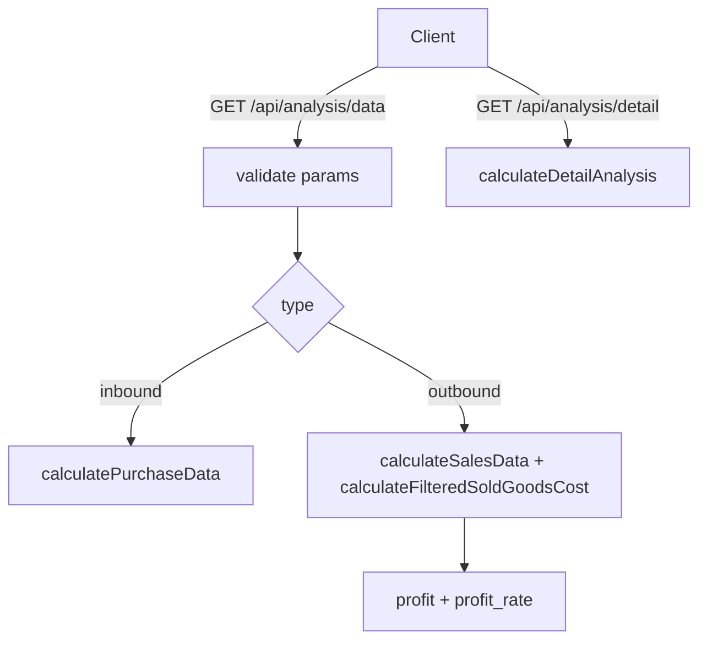
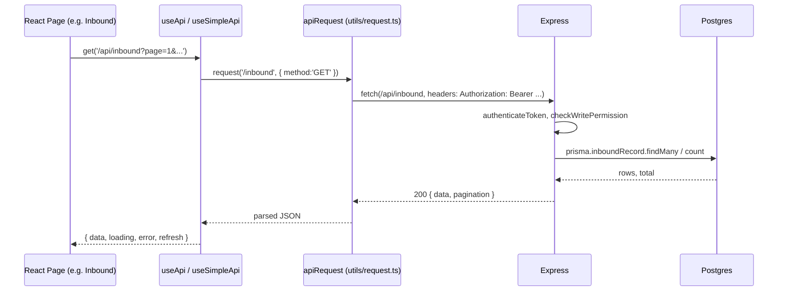

# Data Flow

This document describes how data moves through the system. Use it to understand which tables,
services, and API routes interact when a user action triggers data changes.

> Note: this doc may fall behind the code. When in doubt, search the corresponding route/service
> file (see `API_CATALOG.md`).

---

## 1. System overview

```
┌─────────────────────┐         HTTP/JSON          ┌────────────────────────┐
│  Browser (React SPA)│ ◀────────────────────────▶ │  Express API server    │
│  React 19 + Vite    │   Authorization: Bearer    │  Node.js + TypeScript  │
└─────────────────────┘                            └──────────┬─────────────┘
                                                             │ Prisma ORM
                                                             ▼
                                              ┌──────────────────────────┐
                                              │  PostgreSQL              │
                                              │  (cache/, config/ on FS) │
                                              └──────────────────────────┘
```

Auxiliary state lives in:

- `config/` — YAML/JSON config (config dir discovered by `backend/utils/paths.ts`)
- `cache/` — JSON snapshots (`overview-stats.json`, `invoice-cache.json`, `jwt-secret.txt`)

---

## 2. Inbound flow (purchase)

When a user records a purchase:

```
Client                  POST /api/inbound                  Database / Cache
 │                            │                                  │
 │  ─── body ───────────────▶ │  routes/inbound.ts               │
 │                            │  prisma.inboundRecord.create     │ ──▶ inbound_records
 │                            │  inventoryService.onInboundCreate│
 │                            │     ├─ tx.inventoryLedger.create │ ──▶ inventory_ledger
 │                            │     └─ tx.inventory.upsert       │ ──▶ inventory
 │  ◀── {id, message} ─────── │                                  │
```

Inventory update logic: `backend/utils/inventoryService.ts:onInboundCreate`

- adds `+quantity` to `inventory_ledger.change_qty`
- upserts `inventory.quantity += quantity`
- both inside a single `prisma.$transaction`

Update = revert old + apply new:

```
onInboundUpdate(old, new) = onInboundDelete(old.id) + onInboundCreate(new)
```

Delete = revert:

```
onInboundDelete(id)
  for each ledger row with reference_id=id, change_type='INBOUND':
    inventory.quantity -= ledger.change_qty
  delete those ledger rows
```

---

## 3. Outbound flow (sale)

```
Client                  POST /api/outbound                 Database
 │                            │                                 │
 │  ─── body ───────────────▶ │  routes/outbound.ts             │
 │                            │  prisma.outboundRecord.create   │ ──▶ outbound_records
 │                            │  inventoryService.onOutboundCreate
 │                            │     ├─ ledger.create (qty<0)    │ ──▶ inventory_ledger
 │                            │     └─ inventory.upsert         │ ──▶ inventory
```

`inventoryService.onOutboundCreate` writes the ledger with `change_qty = -quantity` so that
`SUM(change_qty)` per model equals the current stock.

Same revert-then-reapply semantics for `PUT` and `DELETE` as inbound.

---

## 4. Inventory recalculation

`POST /api/inventory/refresh` rebuilds the entire `inventory` and `inventory_ledger` tables from raw
`inbound_records` and `outbound_records`.



Source: `backend/utils/inventoryService.ts:recalculateAll`. Used as a repair tool when ledger/cache
drifts.

---

## 5. Pricing lookup flow

`/api/product-prices/auto` and `/current` resolve the price effective for a given partner and
product on a given date.

```
GET /api/product-prices/auto?partner_short_name=...&product_model=...&date=YYYY-MM-DD
   │
   ▼
prisma.productPrice.findFirst({
  partner_short_name,
  product_model,
  effective_date <= date
}, orderBy: { effective_date: 'desc' })
   │
   ▼
{ unit_price }   (404 if none found)
```

Source: `routes/productPrices.ts` lines around `get /auto` and `get /current`.

---

## 6. Receivable / Payable balance

Receivable (customers) and Payable (suppliers) dashboards aggregate from the raw records.



Implementation uses raw SQL (`$queryRawUnsafe`) for the partner-level aggregation in
`routes/receivable.ts` and `routes/payable.ts`. Pagination + filtering happen at the partner (outer)
level; the inner SUMs are not paginated.

`GET /api/receivable/details/:customer_code` (and the payable mirror) joins all data in a single
response:

```
{
  customer/supplier,
  summary: { total_receivable, total_paid, balance },
  outbound_records:   { data, total, page, limit },
  payment_records:    { data, total, page, limit }
}
```

---

## 7. Invoice cache (per partner)

The invoice groupings are precomputed and persisted to `cache/invoice-cache.json` to avoid
re-aggregating on every page load.



Source: `backend/utils/invoiceCacheService.ts`. Same pattern for suppliers under `/api/payable/...`.

---

## 8. Overview stats (cached aggregates)

`/api/overview/*` reads/writes a JSON snapshot in `cache/overview-stats.json`. The snapshot is only
refreshed on `POST /api/overview/stats` (manual recompute).

```
POST /api/overview/stats
  │
  ├─ out_of_inventory_products   ← prisma.inventory where quantity <= 0
  ├─ overview (counts + sums)    ← inbound/outbound/partner/product aggregates
  ├─ top_sales_products          ← top 10 + "Others" bucket
  └─ monthly_inventory_changes   ← per-product (before-month + current-month deltas)
  │
  ▼
write cache/overview-stats.json
```

`GET /api/overview/stats`, `GET /api/overview/top-sales-products`, and
`GET /api/overview/monthly-inventory-change/:productModel` only read the JSON file. If it is missing
they return `503`.

Frontend pattern: `useApiData` catches the 503, calls the matching `POST` to refresh, then retries
the GET — see `frontend/src/hooks/useApi.ts` (`fetchData` with `autoCreate`).

---

## 9. Analysis flow

The analysis module computes results on demand from the database on every request; it does not use a
file cache. Consumers call `GET /api/analysis/data` (summary) and `GET /api/analysis/detail`
(per-group breakdown) directly.



---

## 10. Auth flow

```
POST /api/auth/login { username, password }
  │
  ├─ loginRateLimiter  (in-memory, per IP+username)
  ├─ prisma.user.findUnique
  ├─ argon2.verify(password, password_hash)
  └─ jwt.sign(payload, secret, HS256)         secret from cache/jwt-secret.txt

Subsequent requests:
  Authorization: Bearer <token>
  │
  ▼
authenticateToken middleware (server.ts)
  ├─ enabled=false? inject dev user, continue
  ├─ /api/auth/*? continue
  ├─ no token → 401
  ├─ jwt.verify + check user.enabled + pwd_ver
  └─ attach req.user

checkWritePermission (server.ts)
  ├─ editor/superuser → ok
  └─ reader
       ├─ GET → ok
       ├─ PUT /api/users/me|/api/users/me/password → ok
       ├─ POST /api/export|overview|analysis → ok (if allowExportsForReader)
       └─ otherwise → 403 READ_ONLY_ACCESS_DENIED

Route-level page authorization then restricts `/api/overview`,
`/api/analysis`, `/api/export`, `/api/payable`, and `/api/receivable` to
editor/superuser users, including their GET requests.
```

Roles enforced:

- `superuser` — full access, including `/api/users/*` (guarded by `authorize(['superuser'])` in
  `routes/users.ts`)
- `editor` — read + write
- `reader` — read-only on the operational pages, can update their own profile and password, and
  cannot access overview, analysis, export, payable, or receivable

---

## 11. Audit logging

`GET /api/audit/logs` reads `system_logs`. Visibility rules:

- `superuser` may filter by any `username`
- `editor` / `reader` see only their own logs
- Filters: `startDate`, `endDate`, `resource` (case-insensitive contains), `params`
  (case-insensitive contains)

Note: writing to `system_logs` happens wherever the audit middleware / write-permission middleware
observes a denied or notable write attempt (e.g. `checkWritePermission` logs reader write attempts).
The catalog of writes is small — grep `prisma.systemLog` in `backend/` to find them.

---

## 12. Export flow

All export endpoints return a binary `.xlsx` (SheetJS). The request body is JSON describing filters
and (for `analysis`) the data set to embed.

```
POST /api/export/<type>
   body: { ...filters, [analysisData] }
   │
   ▼
backend/routes/export/utils  →  builds workbook in memory
   │
   ▼
res.setHeader('Content-Type', 'application/vnd.openxmlformats-officedocument.spreadsheetml.sheet')
res.setHeader('Content-Disposition', `attachment; filename="..."`)
res.send(buffer)
```

Frontend uses `apiRequest.download(url, filename)` which wraps the blob in an object URL and
triggers a click (`frontend/src/utils/request.ts:request.download`).

---

## 13. Frontend → Backend roundtrip



- Auth token lives in `localStorage` under key `auth_token`
  (`frontend/src/auth/auth.ts:tokenManager`).
- `apiRequest` auto-redirects to `/login` on `401` and throws `AuthorizationError` on `403`.
- Routes that need caching (overview) use `useApiData` which retries on `503` by hitting the
  matching POST refresh endpoint.

---

## 14. Cache file map

| File                           | Owner                           | Trigger                                               |
| ------------------------------ | ------------------------------- | ----------------------------------------------------- |
| `cache/jwt-secret.txt`         | `utils/auth.ts:ensureJwtSecret` | First startup (created if missing)                    |
| `cache/overview-stats.json`    | `routes/overview.ts`            | `POST /api/overview/stats`                            |
| `cache/invoice-cache.json`     | `utils/invoiceCacheService.ts`  | `POST /api/{receivable,payable}/invoices/refresh/...` |
| `config/config.yaml` + friends | `utils/paths.ts:getConfigDir`   | Read at boot (`auth.*`, `server.*`, `frontend.*`)     |

Resolution path helpers: `resolveFilesInCachePath`, `resolveFilesInConfigPath` in
`backend/utils/paths.ts`.
